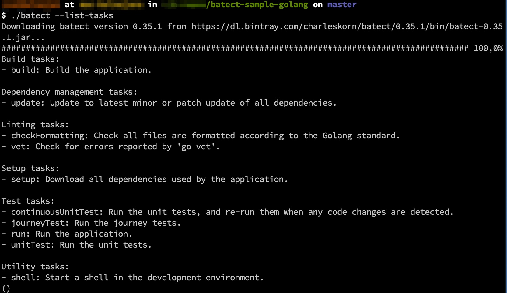

# Batect-Python - Using batect in a python app



[batect](https://github.com/charleskorn/batect) is an interesting tool, tackling an issue I've been dealing with.
It's created by a Charles Korn from ThoughtWorks.

There are already a bunch of full fledged usage examples out there, but I was missing a
smaller example to start with. Especially since Python seems to lend itself to a different dev
work flow than Java or Kotlin (which btw. I don't think is true).

So here is my take on it:

```
.
├── example0   # I fell in love with how simple is was to shell into the container I just
messed up while building it, take a look at this to understand the basics.

├── example1   # This is about getting the dependencies, caching locally to still to REPL deving in a venv
└── example2   # This is a larger example featuring a postgres & a dummy app with an integration test.
```

The examples in detail:

### Example 0: shell into a failing build

So first, while setting up the example1 I had an error during dependency installation.
What do I usually do about that? Comment that part, start up the container and do it by hand.

Now check out this work flow, simply cd into "example0", then simply run

`./batect shell`

and you're in.

My recommendation therefore:
`Best Practice: Use a batect "shell" to exec into your built container. You'll need this while setting things up...`

Now let's start a real example.

### Example 1: Dependencies with Pipenv

Pipenv is the hands down best way to manage dependencies in python.
To enforce the usage of Pipenv, to make sure everyone knows which dependencies
are needed, batect is great. It takes what you normally would do and
pushes it into the container. The only thing you need to take care of
is caching things right, which I set up in this example.

Cd into "example1".
Run:

```
./batect --version
...
```

This will download the right version to your computer. We can check the tasks we created:

```
/batect --list-tasks
...
Available tasks:

- dep: Install dependencies via pipenv
- shell: ...
```

Then run

```
./batect dep
```

to get the docker image and check whether the dependency installation works.

If you take a closer look at how the files are cached it should be pretty straight
forward to point your IDE to the cache to enable REPL programming, as is
common in Python.

### Example 2: An Integration Test

Lastly I created a test firing up more than one container in sync.

Cd into example2 then run `$ ./batect --list-tasks` to see what's possible,
and inspect the batect.yml to figure this out.

## Why batect? My perspective

Batect implements a great idea, that of the .go script:

Implementation of the idea:
"You know you're on a mature dev team when your instructions as a new team member are "check out the repo, run ./go, and you're done"." [ThoughtWorks Blog](https://www.thoughtworks.com/insights/blog/praise-go-script-part-i)

"Onboard new team members in minutes: no installation required"

That's an idea I love. With Polygot programming it is my believe this concept is crucial.
